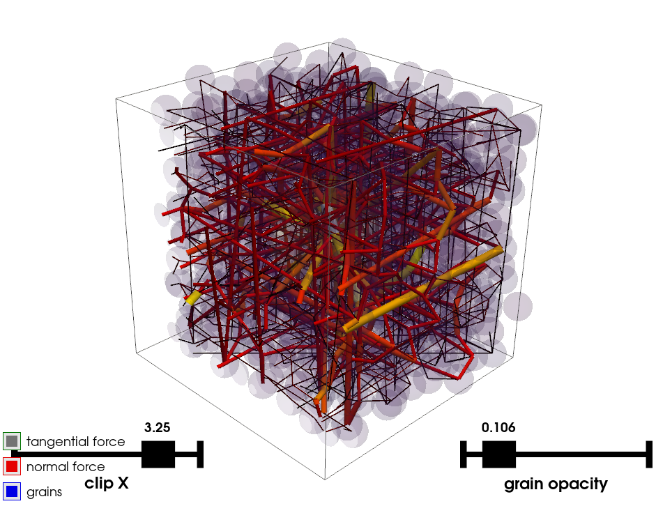

<h1 align="center">Triax&nbsp; × &nbsp;Rosetta</h1>

<p align="center">
  <em>Automatic, multi-language bindings for the triax DEM simulator — generated, not hand-written.</em>
</p>



<p align="center">
  <a href="https://github.com/alfredicus/triax"></a>
  <a href="https://github.com/xaliphostes/rosetta"></a>
  
  
</p>

---

This project points [**Rosetta**](https://github.com/xaliphostes/rosetta) at [**triax**](https://github.com/alfredicus/triax) — a discrete-element (DEM) triaxial compression simulator for granular packings — and, from a single [`manifest.json`](manifest.json), generates ready-to-build bindings for its whole API — **without touching a line of triax's source**.

C++26 reflection (P2996) reads the unmodified triax headers, a small generator is emitted and compiled, and running it produces one self-contained binding project per backend (Python, Node, WebAssembly). The bound surface covers the ten triax types: the math/geometry primitives (`Vec3`, `Quaternion`), the periodic simulation `Box`, the granular state (`Particle`, `Contact`, `ArchivedContact`, `NeighborPair`, `NeighborSearch`), the flat-JSON parameter reader (`JsonParams`) and the `Simulation` driver itself — so a full triaxial test can be configured, run and inspected from Python (see [`example_python.py`](example_python.py)).

triax is header-only (its `.cpp` files are just the executables' main programs), so `user_sources` in the manifest is empty: the headers are compiled straight into each binding.

## Build

### 1. Fetch triax and Rosetta

```sh
cmake -S . -B build && cmake --build build -j
```

This fetches both repos into `extern/` and builds Rosetta's `rosetta_gen` tool. triax's own executables (`triax`, `compact`, `mixture`) are deliberately not built — only its sources are needed.

### 2. Generate the generator for triax

```sh
extern/rosetta/bin/rosetta_gen manifest.json
cmake -S generated -B generated/build && cmake --build generated/build
```

`rosetta_gen` reads the manifest and writes `generated/{bindings.h, triax.cpp, CMakeLists.txt}`; compiling that (with the P2996 clang fork) emits `./generator` at the project root.

### 3. Generate the bindings

```sh
./generator bindings
```

This writes one self-contained project per manifest target: `bindings/python`, `bindings/node`, `bindings/wasm-expanded` (each with its own `CMakeLists.txt` and an auto-generated API `README.md`).

### 4. Compile the bindings

#### Python

```sh
cmake -S bindings/python -B bindings/python/build -DCMAKE_BUILD_TYPE=Release
cmake --build bindings/python/build -j
```

> **`Release` matters here.** The binding compiles the whole simulator into the module; unoptimized, the demo simulation runs ~10× slower (30 min instead of ~2 min).

#### Node.js

```sh
cd bindings/node && npm i && npm run build && cd ../..
```

#### WebAssembly

With a stock [emsdk](https://emscripten.org/docs/getting_started/downloads.html) activated:

```sh
emcmake cmake -S bindings/wasm-expanded -B bindings/wasm-expanded/build
cmake --build bindings/wasm-expanded/build -j
```

## The Python example

```sh
python3 example_python.py
```

[`example_python.py`](example_python.py) walks the bound API in five parts:

1. **Vec3 / Quaternion** — dot, cross, norms, and rotating a vector with a unit quaternion.
2. **Periodic box** — reduced ↔ real coordinates and minimum-image distances: two particles near opposite faces of a 10³ box are 0.4 apart, not 9.6.
3. **JsonParams** — the dependency-free flat-JSON reader every DEM stage uses for its run parameters (typed getters with defaults).
4. **Neighbor search** — 27 particles on a lattice pushed through the Verlet `NeighborSearch`; the candidate pairs are then checked for actual overlap with the box's periodic distance (`pair.inContact` is only resolved by the simulation's force loop).
5. **A real triaxial test** — drives `Simulation` exactly like the `triax` executable: it stages the dense 8788-particle packing shipped in `extern/triax/examples/Triax_vs_Rockable/confpp1` (positions, radii *and* its contact-force network) as `CONF0/confpp1` in a scratch dir (`build/python-demo/`), writes a parameter file, then calls `setInputFile()` + `run()`. The servo holds the lateral stresses at the 0.1 target while the axial strain ramps up; afterwards the script reads the results straight off the object — iterations, principal strains, internal stress tensor diagonal, deviator, contact/sliding counts, final compacity.

The demo stops at an axial strain of 0.001 (~2 min); a real test runs to ~0.1 — raise `max_strain` in the script accordingly. Snapshots land in `build/python-demo/CONF/` and the measurement series in `build/python-demo/SUIVI/`, same as the native executable.

### A note on the binding surface

Rosetta does not capture C++ default arguments, so every bound method parameter must be passed explicitly. The per-backend API reference is auto-generated next to each binding, e.g. [`bindings/python/README.md`](bindings/python/README.md).
